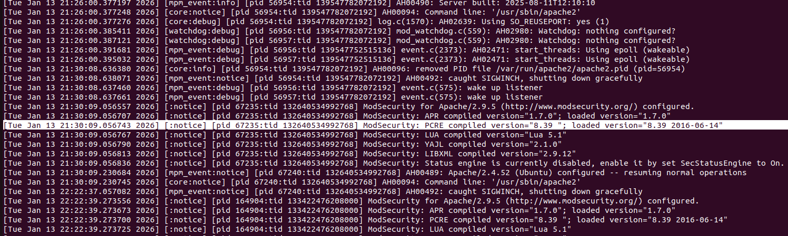
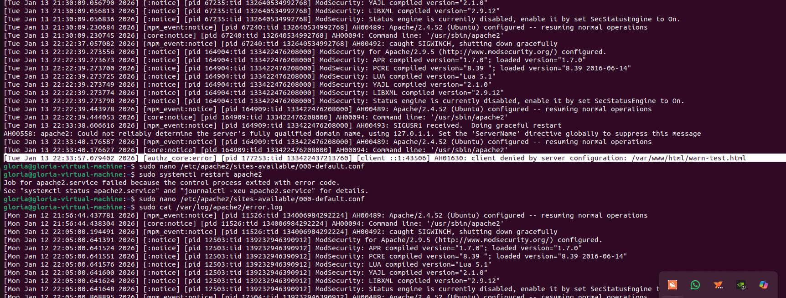

# Security Log Configuration and Monitoring on Apache Web Server

##  Topic Overview

This module demonstrates hands-on practice in **web server security management**, with a focus on **log analysis and access control on Apache Web Server**.

All core scenarios — including **NOTICE, DEBUG, WARN, ERROR, and CRITICAL conditions** — were **studied and practiced in a controlled lab environment**. However, for the purpose of this portfolio, **only log levels that were consistently and verifiably generated under stable conditions are documented**, namely: **NOTICE, DEBUG, and ERROR**.

This approach reflects real-world operational practice, where engineers prioritize documenting **reproducible and evidence-backed observations**, rather than forcing unstable or destructive scenarios into production-like environments.

---

## Learning Objectives

* Understand Apache error log structure
* Identify and interpret log levels: NOTICE, DEBUG, ERROR
* Apply access control rules and observe their impact on logs
* Develop a security-analyst mindset when reading server logs

---

##  Environment

* OS: Ubuntu (Virtual Machine)
* Web Server: Apache 2.4.52
* Modules:

  * mpm_event
  * ModSecurity 2.9.5
* Log file analyzed:

  ```
  /var/log/apache2/error.log
  ```

---

##  Practiced Scenarios & Evidence

### 1️. NOTICE — Module Initialization Information

**Observed Log (Original):**

 

**Explanation:**
This NOTICE log indicates that the **ModSecurity module was successfully loaded** and initialized by Apache. It confirms compatibility between the compiled and loaded PCRE versions, meaning the Web Application Firewall is ready to inspect HTTP traffic.

**Security Relevance:**

* Confirms WAF module readiness
* Indicates normal and expected startup behavior
* No action required by administrator

---

### 2️. DEBUG — Internal Monitoring Process

**Observed Log (Original):**


**Explanation:**
This DEBUG log shows that Apache's **watchdog process is actively running**, performing internal periodic checks every 1000 milliseconds. This component is responsible for supervising internal modules and ensuring service reliability.

**Security Relevance:**

* Demonstrates internal health monitoring
* Useful for advanced troubleshooting
* Typically visible only when debug logging is enabled

---

### 3️. ERROR — Access Control Enforcement

**Observed Log (Original):**



**Explanation:**
This ERROR log was generated when a client attempted to access a protected resource. Apache explicitly denied the request based on access control rules defined in the server configuration.

**Security Relevance:**

* Confirms access restriction rules are enforced correctly
* Represents a request-level security event
* Server remains stable despite request failure

---

* Apache logs are contextual: the same rule can generate different log levels depending on execution flow
* Access denial during an active request is logged as `ERROR`, even though it is an expected security behavior
* Absence of `WARN` and `CRITICAL` logs indicates a **stable and well-configured server** during this module

---

##  Conclusion

This module validates the ability to:

* Configure Apache securely
* Interpret real-world security logs
* Distinguish between normal operations and security-relevant events

Only **NOTICE, DEBUG, and ERROR** log levels are documented, as these were the levels **verifiably generated through hands-on practice**. Future modules may expand into simulated failure scenarios to explore `WARN` and `CRITICAL` conditions.

---

